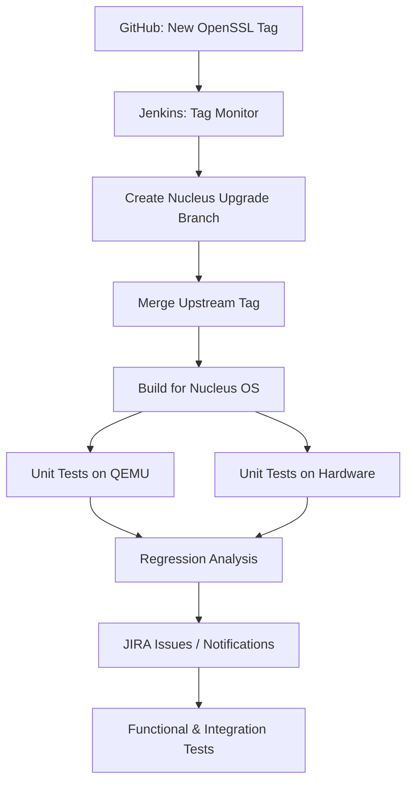

# Automating Open-Source Integration: Reducing Months of Work to a Single Sprint

> **Executive Summary**
>
> While working as a software developer on Nucleus OS, I encountered a recurring bottleneck:  
> integrating large open-source dependencies (OpenSSL, Qt) required months of manual, cross-team effort for every upstream release.
>
> With my manager’s support, I designed and implemented an end-to-end, CI-driven upgrade system that automatically:
> - Tracks upstream releases
> - Applies downstream adaptations
> - Builds and tests across QEMU and real hardware
> - Detects regressions
> - Creates actionable JIRA issues
>
> This reduced dependency upgrade time from **months to a single sprint (~3 weeks)** and transformed upgrades into a predictable, low-risk engineering workflow.

## Context

In embedded operating systems, integrating large open-source components is rarely a drop-in exercise.  
In our case, **Qt Open Source** and **OpenSSL** had to be continuously integrated into **Nucleus OS**, and each new upstream release needed to be evaluated, patched, tested, and validated before it could become part of a product release.

I was part of the **software development team**, but I repeatedly saw upgrades stall due to slow, fragmented handoffs between development, QA, and DevOps activities. Ownership was distributed, but accountability was unclear—making the process fragile and difficult to reason about end-to-end.

With my manager’s awareness and support, I decided to **take ownership of the entire upgrade workflow myself**—not by changing team structures, but by engineering a system that removed the need for constant coordination. I solved this systemic engineering bottleneck by building a self-driving workflow.

This article describes the result: a CI-driven upgrade pipeline that reduced integration time from **months** to **a single sprint (≈3 weeks)**, while improving test coverage, traceability, and confidence.

Although the example focuses on OpenSSL, the approach generalizes naturally to **Qt** and other third-party dependencies.

## The Core Problem

The difficulty was not merely “building” OpenSSL or Qt inside Nucleus OS.
The real challenges were:
- Open-source components required **Nucleus-specific patches**
- Patch sets varied across:
  - Nucleus OS versions
  - Upstream dependency versions
- New upstream releases arrived unpredictably
- Upgrade ownership was **spread across multiple teams**
- Manual workflows caused:
  - Long delays
  - Late regressions
  - Poor traceability

In practice, no single person or system could answer:
- What changed upstream?
- What changed downstream?
- What broke, where, and why?

## Design Philosophy

Instead of optimizing individual steps (builds, tests, merges), I treated dependency upgrades as a **closed-loop system**:

- Detect upstream change automatically
- Apply downstream adaptations deterministically
- Validate continuously across environments
- Compare results against historical baselines
- Create ownership automatically when failures occur

The objective was not “more automation”, but **less organizational friction**. The core innovation was treating open-source integration as a continuous delivery problem rather than a periodic engineering hurdle.

## High-Level Solution

I designed an **end-to-end, CI-driven upgrade pipeline** that:
1. Tracks upstream releases automatically  
2. Creates Nucleus-specific upgrade branches deterministically  
3. Builds and tests on QEMU and real hardware  
4. Detects regressions and improvements  
5. Integrates directly with JIRA  
6. Notifies stakeholders at every critical step  

This converted dependency upgrades from a **manual, reactive activity** into a **predictable engineering workflow**.

## Architecture Overview (OpenSSL Example)

### Repository Model


### Repository Strategy

Due to company policy, Nucleus-specific branches could not be pushed to public GitHub.
To address this:
- An **internal mirror** of the OpenSSL repository was maintained
- The internal remote contained:
  - Upstream tags
  - Nucleus-specific branches
- GitHub remained the authoritative upstream source

### Upgrade Flow



### Step 1: Upstream Release Detection

A Jenkins job ran every 24 hours and:
- Checked out OpenSSL from:
  - GitHub (upstream)
  - Internal mirror (downstream)
- Executed a Python script to compare tag lists

If a new upstream tag appeared, the upgrade pipeline was triggered automatically.

### Step 2: Automated Branch Creation and Merge

Given a new upstream version `Y`:
1. An existing downstream branch was selected:
```
version_X_nucleus_version_A
```
2. A new branch was created:
```
version_Y_nucleus_version_A
```
3. The upstream tag `version_Y` was merged

- Incremental upgrades kept conflicts rare.  
- If conflicts occurred, the pipeline paused cleanly for **human intervention**.
- Stakeholders were notified regardless of outcome.

### Step 3: Automated Build and Unit Testing

After merging:
- OpenSSL was cross-compiled for Nucleus OS
- Unit tests were executed on:
- QEMU
- Multiple real hardware platforms

This relied on a **Python-based hardware orchestration framework** I had built earlier, capable of:
- Reserving embedded boards
- Deploying images
- Running tests
- Collecting logs and reports automatically

### Step 4: Regression and Improvement Analysis

Post-test Jenkins jobs:
- Compared new results against historical baselines
- Detected regressions and improvements
- Flagged flaky or unstable tests

Significant changes triggered targeted notifications.

### Step 5: Automatic JIRA Integration

To close the loop:

- Failing tests were matched against existing JIRA issues
- Missing issues were created automatically with:
- Logs
- Version metadata
- Platform details

Failures always resulted in **actionable ownership**, not silent emails.

### Step 6: Functional and Integration Testing

If unit tests passed:
- Functional and selected integration tests ran automatically
- The same regression detection and JIRA logic applied

At completion, each upgrade was either:
- Clearly validated and ready, or
- Blocked with precise, traceable issues

## Impact

The results were both measurable and sustained:
- **Integration time reduced**  
Months → **one sprint (~3 weeks)**
- **Earlier regression detection**
- **Consistent validation across hardware**
- **Reduced reliance on manual coordination**
- **Higher release confidence**

All achieved without reorganizing teams—by **engineering the process itself**.

## Why This Generalizes

Although implemented for OpenSSL and Qt in Nucleus OS, this approach applies broadly to:
- Embedded platforms
- SDKs and middleware
- Any system with patched third-party dependencies

At its core, this work demonstrates that **cross-team friction is often a systems problem, not a people problem**.

## Lessons Learned

- Dependency upgrades should be treated as **first-class engineering workflows**
- CI systems should create **ownership**, not just artifacts
- Hardware-in-the-loop testing is practical when automated properly
- Good automation reduces coordination cost more than meetings ever will

## Closing Thoughts

Open-source dependencies evolve continuously.  
Manual, people-dependent upgrade processes do not scale.

By building a closed-loop, CI-driven system with validation, feedback, and ownership baked in, dependency upgrades can become routine rather than disruptive.

That was the motivation behind this work—and the results validated the approach.